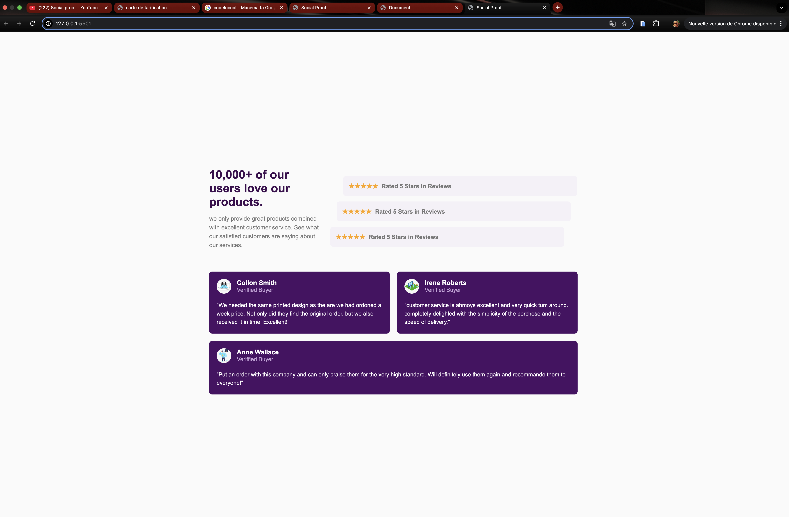

# Projet : Page d'Avis Clients (Social Proof)

## Description du Projet

Ce projet est l'intégration d'une page de type "Social Proof Section" (ou section de preuves sociales/témoignages) utilisant HTML et CSS (incluant le Flexbox et le Grid).

L'objectif principal est de présenter de manière élégante une section de titres et de notations, suivie d'une série de cartes de témoignages clients. Le design est entièrement Responsive, assurant une adaptation parfaite aux différentes tailles d'écran, du bureau au mobile (tablette et smartphone).

## Fonctionnalités
* Structure HTML Sémantique: Utilisation appropriée des balises` <section>`, `<h1>`, `
`, etc.
* **Design Responsive**: Mise en page adaptative pour les ordinateurs de bureau, les tablettes ($768\text{px}$) et les téléphones mobiles ($425\text{px}$).
* **Mise en Page Moderne**:
    * **Section 1 (En-tête/Notations)**: Utilise Flexbox pour disposer le texte à gauche et les blocs de notation à droite sur grand écran, puis passe en disposition verticale (column) sur mobile.
    * **Section 2 (Témoignages)**: Utilise CSS Grid pour positionner les cartes de témoignages de manière optimale sur grand écran, et une disposition verticale sur mobile.
* **Effets Visuels**: Ajout d'un effet :hover (survol) sur les blocs de notation et les cartes de témoignages.
* **Centrage du Contenu**: Le contenu est centré verticalement et horizontalement sur la page.

## Technologies Utilisées

* **HTML5**: Structure de la page web.
* **CSS5**: Styles, y compris Flexbox et CSS Grid pour la mise en page.

##
[Le lien qui mène vers le traivail](https://yacineabdou.github.io/Social-Proof/)